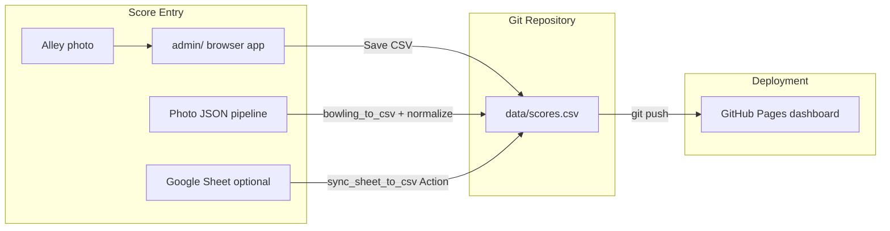

# Data Ingestion Architecture

## Chosen approach: Unified local admin + git (hybrid)

**Primary:** `admin/` — browser-based score admin served locally  
**Canonical file:** `data/scores.csv` in git  
**Optional:** Google Sheets sync via GitHub Actions (mobile-friendly supplement)

This is a **hybrid**: local admin for data quality and photo-assisted entry; git for deployment; optional sheet for phone-only nights.

---

## Rejected approaches

### A. Google Sheets as sole source of truth

| Pros | Cons |
|------|------|
| Easy mobile entry | Frame-by-frame entry awkward in cells |
| No local setup | Validation weaker in spreadsheet |
| | Two-way sync complexity |
| | Photo transcription still manual |

**Verdict:** Kept as **optional supplement** (`sync-scores.yml`), not primary. Sheet is poor for 29-column frame data.

### B. Local admin only (no sheet)

| Pros | Cons |
|------|------|
| Best data integrity | Requires laptop/browser after bowling |
| Photo panel beside grid | No phone-native entry |

**Verdict:** **Primary path** — best balance for this project's data shape.

### C. GitHub API writeback from static admin

| Pros | Cons |
|------|------|
| No manual git push | OAuth/PAT management |
| | Security risk if tokens exposed |
| | Merge conflict handling |

**Verdict:** Rejected — maintenance burden; `save_scores.py` + git push is simpler and safer.

### D. Supabase / dedicated backend

Violates no-backend requirement. Rejected.

### E. Streamlit as primary UI

| Pros | Cons |
|------|------|
| Python validation built-in | Extra dependency to run |
| | Poor photo side-by-side UX |
| | Heavier than static admin |

**Verdict:** `review_tool.py` kept as optional bulk editor, not primary entry.

---

## Justification

| Priority | How admin hybrid wins |
|----------|----------------------|
| Lowest maintenance | One admin app; shared `bowling-core.js`; CSV stays source of truth |
| Lowest cost | $0 — static files + optional free Actions |
| No backend | Admin is static; Python CLI is dev-time only |
| GitHub Pages | Dashboard unchanged; reads committed `data/scores.csv` |
| Easy after bowling | Grid entry + photo reference; optional sheet for quick metadata |

---

## Data flow

---

## Future workflow (after league night)

### Standard path (recommended)

1. Double-click **`Open Admin.bat`** (or `python -m http.server 8080` → open `/admin/`)
2. Click **+ New Game** — set date, lane, session #
3. **Upload photo** — scoreboard image beside entry grid
4. Enter frame scores for each player (nickname auto-fills player name)
5. Validation bar shows green when all rows valid
6. **Save CSV** → save to `data/scores.csv` (File System Access API or download)
7. If downloaded: `python tools/save_scores.py -i ~/Downloads/scores.csv`
8. `git add data/scores.csv && git commit -m "Add session YYYY-MM-DD" && git push`
9. Dashboard updates on GitHub Pages within ~1 minute

### Optional: Google Sheet supplement

For nights when you only have a phone:

1. Append summary rows or use sheet for game metadata
2. Run **Actions → Sync scores from Google Sheet** (requires `GOOGLE_SHEET_CSV_URL` secret)
3. Or transcribe fully in admin later using photos from camera roll

### Optional: Photo JSON bulk import

1. Transcribe photos to JSON in `game-images/`
2. `python tools/bowling_to_csv.py game-images/ -o game-images/output.csv`
3. Import via admin **Load CSV** or merge with `normalize_data.py`

---

## Migration plan

### Completed

- [x] Create `js/bowling-core.js` as canonical JS library
- [x] Build `admin/` with entry, validation, search, photo panel
- [x] Add `tools/save_scores.py` validation gate
- [x] Replace `score-entry.html` with admin (+ redirect stub)
- [x] Remove `import-games-csv.js`
- [x] Refactor dashboard to use `BowlingCore`

### Your one-time steps

1. Use **`Open Admin.bat`** — confirm 110 historical games load
2. (Optional) Set up Google Sheet sync per secret `GOOGLE_SHEET_CSV_URL`
3. Retire manual CSV editing in IDE — use admin exclusively

### Rollback

- Historical data unchanged in `data/scores.csv`
- Dashboard requires no changes if rolling back admin
- Restore from `data/backups/` if needed

---

## Schema

Unchanged — 29 columns per `data/sheet-template.csv`. Admin and dashboard both consume this schema via `BowlingCore.CSV_HEADER`.

---

## Integrity guarantees

| Check | Where |
|-------|-------|
| Live score calculation | Admin grid (`BowlingCore.scoreGame`) |
| Missing date/lane/session | `BowlingCore.validateRow` |
| Score mismatch | Computed vs stored final |
| Duplicate game_id + player | `BowlingCore.findDuplicateKeys` |
| Pre-write gate | `tools/save_scores.py` |
| CI optional | `sync-scores.yml` uses Python validator |

---

## Component reference

| Component | Role |
|-----------|------|
| `admin/` | Primary human entry interface |
| `data/scores.csv` | Canonical persisted data |
| `js/bowling-core.js` | Shared scoring/CSV/validation |
| `tools/save_scores.py` | Safe write with backup |
| `tools/bowling_to_csv.py` | Photo JSON import |
| `tools/sync_sheet_to_csv.py` | Optional sheet import |
| `tools/review_tool.py` | Optional bulk correction UI |
| `index.html` | Read-only analytics dashboard |
